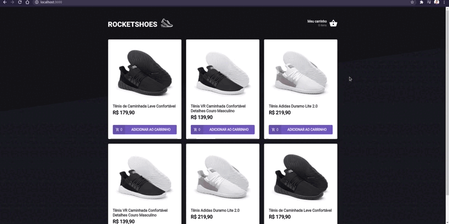

<h1 align="center">
  
</h1>

<p align="center">
     
</p>

<p align="center">
  <a href="#-tecnologias">Tecnologias</a>&nbsp;&nbsp;&nbsp;|&nbsp;&nbsp;&nbsp;
  <a href="#-projeto">Projeto</a>&nbsp;&nbsp;&nbsp;|&nbsp;&nbsp;&nbsp;
  <a href="#-como-usar?">Como usar?</a>&nbsp;&nbsp;&nbsp;&nbsp;&nbsp;&nbsp;
</p>

## 🛠 Tecnologias 🚀

Este projeto foi desenvolvido com as seguintes tecnologias:

- <a href="https://pt-br.reactjs.org/">React</a>
- <a href="https://www.typescriptlang.org/">Typescript</a>
- <a href="https://styled-components.com/">Styled-Components</a>
- <a href="https://github.com/typicode/json-server">Json-server</a>
- <a href="https://pt-br.reactjs.org/docs/hooks-intro.html">Hooks</a>
- <a href="https://polished.js.org/">Polished</a>
- <a href="https://react-icons.github.io/react-icons/">React-Icons</a>
- <a href="https://fkhadra.github.io/react-toastify/introduction">React-Toastify</a>
- <a href="https://pt-br.reactjs.org/docs/context.html">ContexAPI</a>
- <a href="https://yarnpkg.com/">Yarn</a>

## 💻 Projeto

O rocketshoes é um desafio que foi proposto durante o chapter2 ( módulo 2) do bootcamp ignite da rocketseat.
O desafio consistia em desenvolver uma aplicação onde o principal objetivo era criar um hook de carrinho de compras. No ínicio do desafio tinhamos acesso a duas páginas, um componente e um hook para implementar as seguintes funcionalidades:
- Adicionar um novo produto ao carrinho;
- Remover um produto do carrinho;
- Alterar a quantidade de um produto no carrinho;
- Cálculo dos preços sub-total e total do carrinho;
- Validação de estoque;
- Exibição de mensagens de erro, etc;

## ⌨ Como usar?

Em primeiro lugar, clone o repositório:

```bash
# Clonando o repositório
git clone https://github.com/hitaloalvess/rocketshoes.git

# ✅ Em sequência:

# Instale as dependências:
yarn install

# Iniciando servidor
yarn server

# Iniciando projeto
yarn start
```

---
Made with ♥ by Hitalo 🚀

